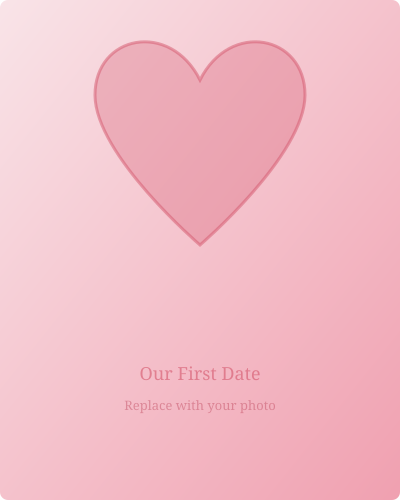

# Valentine's Day Website

A beautiful, romantic Valentine's Day website with smooth animations, interactive elements, and a mobile-responsive design.

## Quick Start

Open `index.html` in any modern web browser. No build tools or server required.

## How to Customize

### Replacing Photos

1. Navigate to the `images/` folder
2. Replace `photo-1.svg` through `photo-6.svg` with your own images (JPG, PNG, or WebP recommended)
3. In `index.html`, update the `src` attribute for each `` tag in the **PHOTO GALLERY** section:

```html
<!-- Change this: -->


<!-- To this: -->

```

4. Update the `alt` text and the overlay caption (`<p>` tag inside `.gallery-overlay`) for each photo

### Editing Text Content

All text is in `index.html`. Each section is clearly labeled with HTML comments. Key areas to edit:

| Section | What to change |
|---------|---------------|
| **Hero** | Update the title, subtitle, and pre-heading text |
| **Love Letter** | Rewrite the paragraphs inside `.letter-content` |
| **Timeline** | Edit dates, titles, and descriptions for each `.timeline-entry` |
| **Reasons** | Change the messages inside each `.reason-back` paragraph |
| **Countdown** | Set the target date in `js/script.js` (see below) |

### Changing the Countdown Date

Open `js/script.js` and edit the `CONFIG` object at the top:

```javascript
const CONFIG = {
    COUNTDOWN_DATE: "June 15, 2026 00:00:00",  // Your target date
    COUNTDOWN_EVENT: "Our Next Anniversary",     // Label above the timer
    NUM_BACKGROUND_HEARTS: 15,                   // Floating hearts count
};
```

### Changing Colors

Open `css/styles.css` and edit the CSS custom properties in the `:root` block at the top:

```css
:root {
    --color-primary:       #d4556b;   /* Main rose pink       */
    --color-primary-dark:  #b8384f;   /* Darker rose          */
    --color-primary-light: #f0a0b0;   /* Light blush          */
    --color-accent:        #e8768a;   /* Soft coral           */
    --color-gold:          #d4a574;   /* Warm gold accent     */
    --color-bg-cream:      #fdf6f0;   /* Page background      */
    --color-bg-blush:      #fef0f3;   /* Blush section bg     */
    --color-bg-deep:       #2c1a23;   /* Dark romantic bg     */
    /* ... more variables below */
}
```

### Adding Background Music (Optional)

1. Place an MP3 file named `our-song.mp3` in the `images/` folder
2. The music button (bottom-right corner) will play/pause it when clicked

## Deploying with GitHub Pages (Free)

1. Create a GitHub repository and push this project to it
2. Go to **Settings > Pages** in your repository
3. Under **Source**, select the branch (e.g., `main`) and folder (`/ (root)`)
4. Click **Save**
5. Your site will be live at `https://yourusername.github.io/your-repo-name/`

### Alternative: Netlify (also free)

1. Go to [netlify.com](https://www.netlify.com/) and sign up
2. Drag and drop the entire project folder onto the Netlify dashboard
3. Your site goes live instantly with a shareable URL

### Alternative: Vercel (also free)

1. Go to [vercel.com](https://vercel.com/) and sign up
2. Import the GitHub repository or drag and drop
3. Deploy with one click

## Project Structure

```
vday/
├── index.html              Main HTML file (all content here)
├── css/
│   └── styles.css          All styling, colors, animations
├── js/
│   └── script.js           Interactivity, countdown, scroll effects
├── images/
│   ├── photo-1.svg         Placeholder image 1 (replace with your photo)
│   ├── photo-2.svg         Placeholder image 2
│   ├── photo-3.svg         Placeholder image 3
│   ├── photo-4.svg         Placeholder image 4
│   ├── photo-5.svg         Placeholder image 5
│   └── photo-6.svg         Placeholder image 6
└── README.md               This file
```

## Features

- **Hero Section**: Full-screen landing with animated floating hearts and heartbeat animation
- **Photo Gallery**: 6-photo grid with hover zoom and caption overlays
- **Love Letter**: Elegant letter card with decorative seal
- **Memory Timeline**: Alternating vertical timeline of special moments
- **Reasons I Love You**: 8 interactive flip cards with hidden messages
- **Countdown Timer**: Live countdown to your next special date
- **Background Hearts**: Subtle floating hearts throughout the page
- **Scroll Animations**: Elements fade in as you scroll down
- **Parallax Effect**: Hero content has subtle parallax movement
- **Music Toggle**: Optional background music player
- **Responsive**: Works on all screen sizes (desktop, tablet, phone)
- **Accessible**: Keyboard navigation support for interactive elements

## Browser Support

Works in all modern browsers: Chrome, Firefox, Safari, Edge.
